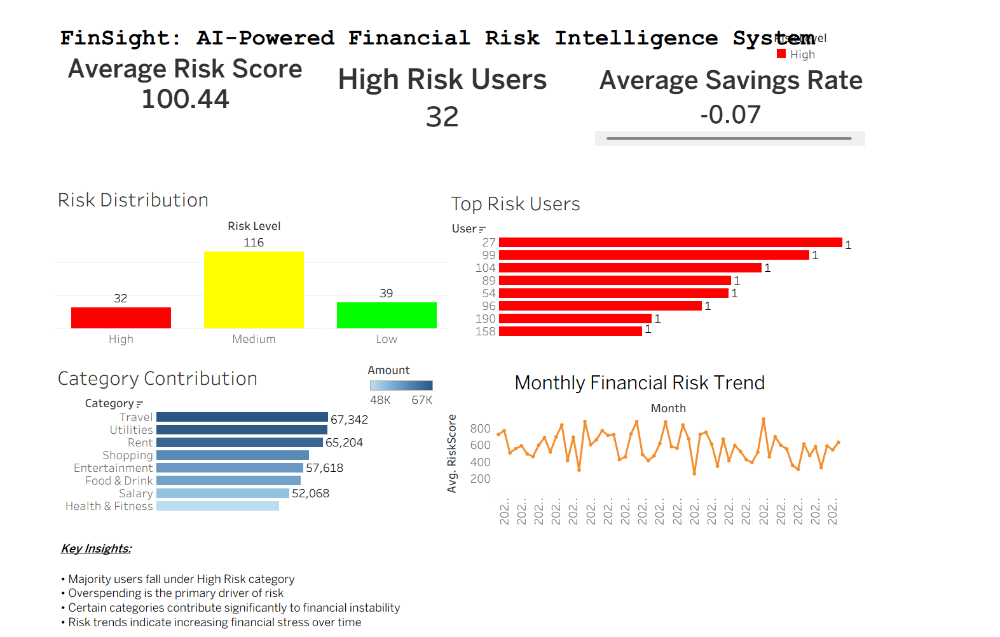

# 🚀 FinSight: AI-Powered Financial Risk Intelligence System

## 📌 Overview

FinSight is a data-driven financial analytics system that evaluates user financial health by combining **personal transaction behavior** with **market sentiment analysis**.

The system generates a **composite financial risk score**, enabling deeper insights into spending patterns, financial stability, and potential risk exposure.

---

## 🎯 Problem Statement

Traditional financial risk systems rely only on historical transaction data, ignoring external factors such as **market sentiment and financial news**.

This leads to:

* Incomplete risk evaluation
* Poor financial decision-making
* Lack of proactive insights

---

## 💡 Solution

FinSight integrates:

* 📊 User financial behavior
* 📰 Financial news sentiment (NLP)

To produce:

* ✅ Financial Health Score
* ✅ Overspending Index
* ✅ Market Sentiment Score
* ✅ Combined Financial Risk Score

---

## 🏗️ System Architecture

Transaction Data + Financial News Data
⬇
Data Cleaning & Processing (Python)
⬇
Behavior Analysis + Sentiment Analysis
⬇
Risk Fusion Engine
⬇
Processed Dataset
⬇
📊 Tableau Dashboard (Visualization Layer)

---

## ⚙️ Tech Stack

### 🐍 Backend (Python)

* Pandas → Data processing
* NumPy → Calculations
* VADER → Sentiment analysis
* Scikit-learn → Machine Learning

### 📊 Visualization

#### 📊 Tableau Dashboard Preview



---

## 📂 Project Structure

```
AI-Financial-Risk-Engine/
│
├── data/                # Raw datasets
├── output/              # Processed datasets
├── src/                 # Core logic
│   ├── data_cleaning.py
│   ├── behavior.py
│   ├── sentiment.py
│   ├── risk_engine.py
│   ├── time_analysis.py
│   ├── ml_model.py
│   └── insights.py
│
├── dashboard/
│   ├── FinSight.twbx
│   └── dashboard.png
│
├── main.py
├── requirements.txt
└── README.md
```

---

## 🔍 Key Features

### 1️⃣ Financial Behavior Analysis

* Income vs Expense tracking
* Savings & savings rate calculation
* Overspending detection
* Category-wise spending analysis

---

### 2️⃣ Market Sentiment Analysis

* Financial news processing
* Sentiment classification (Positive / Neutral / Negative)
* Market Sentiment Score generation

---

### 3️⃣ Risk Engine (Core Innovation 🔥)

Combines:

* User behavior
* Market sentiment

Generates:

* Financial Health Score
* Overspending Index
* Market Sensitivity Index
* Final Risk Score

---

### 4️⃣ Multi-User Risk Profiling

* Simulated multiple users
* Risk comparison across users
* Identification of high-risk individuals

---

### 5️⃣ Time-Based Risk Analysis

* Monthly risk computation
* Trend analysis over time
* Detection of financial instability periods

---

### 6️⃣ Machine Learning Model

* Linear Regression
* Decision Tree
* Random Forest

Used to:

* Predict financial risk
* Identify key drivers of risk

---

### 7️⃣ Recommendation Engine

* Suggests actions based on user behavior
* Example:

  * Reduce spending in high-risk categories
  * Improve savings rate

---

## 📊 Dashboard Preview


---

## 📈 Key Insights

* Majority of users fall under **High Risk category**
* Overspending is the **primary driver of risk**
* Categories like Travel and Utilities contribute significantly
* Risk trends indicate **increasing financial instability over time**

---

## 📊 Key Metrics

* Financial Health Score
* Savings Rate
* Overspending Index
* Market Sentiment Score
* Risk Score

---

## 🚀 How to Run

### 1️⃣ Install Dependencies

```bash
pip install -r requirements.txt
```

---

### 2️⃣ Run the Project

```bash
python main.py
```

---

### 3️⃣ Open Dashboard

* Open Tableau
* Load `dashboard/FinSight.twbx`

---

## 🔮 Future Enhancements

* Real-time API integration
* Advanced ML models (XGBoost, Deep Learning)
* Personalized financial recommendations
* Web application deployment (Streamlit)

---

## 🎯 Business Impact

This system can be used by fintech platforms like:

* CRED
* Paytm
* Razorpay

To:

* Improve financial awareness
* Reduce default risk
* Enable personalized financial insights

---

## 💬 Resume Description

Developed an AI-powered financial risk engine integrating user transaction data with financial news sentiment analysis to generate a composite risk score, supported by an interactive Tableau dashboard for data-driven insights.

---

👨‍💻 Author

Shravya Jain
---
